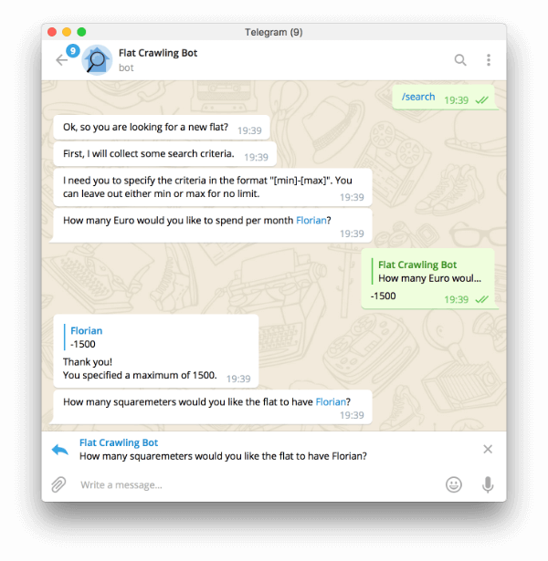

# flatcrawl-processors

This repository is part of my **flatcrawl project**. The processors will receive new flats from the message broker (ie. RabbitMQ). They will then evaluate the flats against the user defined searches and send them notifications on different channels (ie. Telegram), when they have a match.

If you are interested in how the flats end up at the message broker: there's [another repository that contains the different crawlers](https://github.com/floschnell/flatcrawl-crawlers) which will extract the flat information from the different rental portals and then sends them to the message broker's queue.

## The flatcrawl project

The purpose of the project is to **collect flats from different rental sites** and **expose them in a consistent shape**. Eventually it lets users define **custom searches** and provides them with **instant updates on new matching flats**.

**Clarification**: flats are *not* stored on the server. The purpose is not to create a competing portal, but to extend usability and help users find the right flat quickly by receiving updates from several sites without the hassle to setup and maintain different searches.

## Usage

This chapter describes how to use the flatcrawler. Only thing that you will need is the [Telegram App](https://telegram.org/) on either your smartphone, your computer or any other supported device.

### Create a Search

To create a search, you need to get in touch with the FlatCrawl bot. You can search for it and communicate with it like with any other contact in Telegram.
Use the app's search field and look for *FlatcrawlBot*. Once found, click onto it and hit the Start button to begin a conversation.

Right now the bot is capable of a few commands that you can simply type into the conversation window. To start a search, simply type `/search`. Afterwards the bot will ask you some questions and eventually keep looking for flats that match your criteria.



Once the search is setup, the bot will output an numeric ID. Remember it well. The bot will not start to send flats right away! This is because you might want to be notified within a group, so that all your potential flat mates receive the offers as well. This is very helpful, because all members of the group will then be able to discuss the different flats just as they are popping in.

### Subscribe to a Search

To continuously receive new flats that match your search criteria, first go to the chat or group conversation where you would like to be notified. Then open the chat menu and add a new member. Search and choose the *FlatcrawlBot*.

Then, back in the chat, you just need to enter `/subscribe [ID]`. Of course, you will need to replace [ID] with the ID that the bot provided you with, when you finished the search setup.

That's it, now you will receive all the new flats that get posted on all the different web portals if they only match your search criteria.

## Development

This project consists of three parts:
- **Firebase Realtime Database:** Stores found flats, users and their configured searches.
- **Crawling Scheduler:** A tool that can be setup on a local node with changing IP address. It has yet crawling implementations for different flat renting search engines.
- **Telegram Processor:** Client application that will listen for changes on the realtime database. As soon as a new flat becomes available it will check all user searches and send out messages whenever matches have been found.

Of those **only the crawler and telegram client are under source control**. However, if you setup a firebase account and create an empty database, it will then be filled automatically as soon as you run the crawling application.

### Setup
If you want to run the whole infrastructure yourself, you will need to do the following things:
1) Create a [Firebase account](https://firebase.google.com/) and setup an empty realtime database.
2) [Create a Telegram bot via the BotFather](https://core.telegram.org/bots#creating-a-new-bot).
3) Create a Google API Key for the Directions API
4) Create the `src/config.ts` file and fill it with the information you should have acquired from step 1, 2 and 3:
```typescript
// from step 1
export const DATABASE_KEY = '...';
export const DATABASE_URL = '...';
// from step 2
export const BOT_ID = '...';
export const BOT_TOKEN = '...:...';
// from step 3
export const GOOGLE_API_KEY = '...';
```
5) Finally - for the webhooks to work - you will also need to create a self signed SSL certificate like so:
```bash
openssl req -newkey rsa:2048 -sha256 -nodes -keyout ./certs/private.key -x509 -days 365 -out ./certs/public.pem -subj "/C=DE/ST=Bavaria/L=Munich/O=/CN=YOURDOMAIN.EXAMPLE"
```
You will need to replace YOURDOMAIN.EXAMPLE with the public domain via that the bot can be found.

### Build
Before you can build the code, you need to install all dependencies:
```
yarn install
```
After that, you can run
```
yarn build
```
which will compile all Typescript files and put them in a folder called `dist/`.

### Run
Once you have completed the setup and build steps, you can run the crawler and telegram client.

#### Crawler
```
yarn start:crawler
```

#### Telegram Client
```
yarn start:client
```